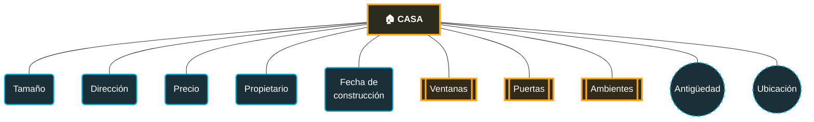

## 📌¿QUÉ ES Y PARA QUE SE USA?
SQL ( STRUCTURED QUERY LENGUGAGE ) -  LENGUAJE DE CONSULTA ESTRUCTURADO
-Base de datos que permite hacer consultas masivamente donde realiza operaciones (CRUD) como 
-CREATE: Crear o insertar nuevos datos. (Como registrar un nuevo usuario)
-READ: Leer o consultar y extraer información. (Como ver la lista de productos mas vendidos)
-UPDATE: Actualizar o modificar datos existentes. (Cambiar un dato existente)
-DELETE: Borrar o eliminar registros  (Eliminar un registro, cuenta, numero o correo)

## CATEGORIAS FUNDAMENTALES DE COMANDOS EN SQL

| DML | Lenguaje modelado de datos           |
| --- | ------------------------------------ |
| DDL | lenguaje de definicion de datos      |
| DCL | lenguaje de control de datos         |
| TCL | lenguaje de control de transacciones |

## LA ESTRUCTURA DE LOS DATOS

## 1. La Estructura de los Datos

- **Base de datos (Database):** Es el contenedor principal. 
    
- **Tablas (Tables):** Son los "estantes" o carpetas dentro de la base de datos. Cada tabla guarda información sobre un tema específico (por ejemplo, una tabla de `Clientes`, otra de `Productos` y otra de `Pedidos`).
    
- **Columnas / Campos (Columns / Fields):** Son las categorías de información que definen a la tabla. Representan las características verticales (por ejemplo: `Nombre`, `Email`, `Fecha de nacimiento`).
    
- **Filas / Registros (Rows / Records):** Es cada elemento individual de la tabla. Representan los datos horizontales completos de un sujeto (por ejemplo, los datos específicos del cliente "Juan Pérez").
    

## 2. Claves (Keys): Los puentes entre datos

Como las bases de datos están compuestas por muchas tablas, necesitamos una forma de conectarlas entre sí sin que se mezclen los datos. Para eso usamos las **Claves**:

- **Clave Primaria (Primary Key - PK):** Es el identificador único e irrepetible de cada fila en una tabla. Podría ser un DNI o el ID de usuario. No puede haber dos clientes con el mismo ID.
    
- **Clave Foránea o Extranjera (Foreign Key - FK):** Es una columna en una tabla que se conecta con la Clave Primaria de _otra_ tabla. Es el "ancla" que une ambas tablas. Por ejemplo, en la tabla `Pedidos`, se guardaría el `ID_Cliente` para saber exactamente quién hizo la compra sin tener que volver a escribir todo su nombre y dirección.
    

## 3. Relaciones (Relationships)

Gracias a las claves, las tablas pueden relacionarse entre sí. Existen tres tipos de relaciones fundamentales:

|   Uno a Uno (1:1):    | Un registro de la Tabla A se relaciona con solo un registro de la Tabla B. _(Ejemplo: Un `Usuario` tiene un solo `Perfil` de preferencias)._                                                                   |
|:---------------------:| -------------------------------------------------------------------------------------------------------------------------------------------------------------------------------------------------------------- |
|  Uno a Muchos (1:N)   | El tipo más común. Un registro de la Tabla A se relaciona con muchos de la Tabla B. _(Ejemplo: Un `Cliente` puede realizar muchos `Pedidos`, pero cada pedido pertenece a un solo cliente).                    |
| Muchos a Muchos (N:M) | Muchos registros de la Tabla A se relacionan con muchos de la Tabla B. _(Ejemplo: Muchos `Estudiantes` pueden inscribirse en muchos `Cursos`). En la práctica, esto se resuelve creando una tabla intermedia._ |
## NOTACION DE CHEN

La notación de Chen es la forma de dibujar un **Modelo Entidad-Relación (MER)** propuesta por Peter Chen en 1976. Es la base gráfica que se usa antes de pasar al diseño de tablas en SQL.

## Elementos básicos

| Elemento                  | Forma                             | Significado                                                                                                        |
| ------------------------- | --------------------------------- | ------------------------------------------------------------------------------------------------------------------ |
| **Entidad**               | Rectángulo                        | Un objeto o concepto del mundo real (ej. `Casa`, `Cliente`, `Producto`)                                            |
| **Atributo simple**       | Elipse (una línea)                | Una propiedad de la entidad que no se puede dividir (ej. `Precio`)                                                 |
| **Atributo compuesto**    | Elipse con "sub-elipses" colgando | Un atributo que se puede dividir en partes (ej. `Nombre` → `Nombre` + `Apellido`)                                  |
| **Atributo multivaluado** | Elipse doble                      | Un atributo que puede tener **varios valores** para una misma entidad (ej. una casa puede tener varias `Ventanas`) |
| **Atributo derivado**     | Elipse punteada                   | Un atributo que se calcula a partir de otro (ej. `Antigüedad` se calcula desde `Fecha de construcción`)            |
| **Atributo clave**        | Elipse con texto subrayado        | El atributo que identifica de forma única a la entidad (llave primaria)                                            |
| **Relación**              | Rombo                             | Un verbo que conecta dos entidades (ej. `Cliente` — _compra_ — `Producto`)                                         |

> [!tip] Regla rápida Si te preguntas "¿esto puede repetirse varias veces para la misma fila?" → es **multivaluado**. Si te preguntas "¿esto lo puedo calcular con otro dato que ya tengo?" → es **derivado**.

## Diagrama: entidad Casa

**Leyenda de formas usadas arriba** (adaptadas a lo que Mermaid permite dibujar):

- Rectángulo `["..."]` → Entidad
- Óvalo `("...")` → Atributo simple
- Doble borde `[["..."]]` → Atributo multivaluado (Ventanas, Puertas, Ambientes: una casa puede tener varias)
- Círculo `(("..."))` con borde punteado → Atributo derivado (Antigüedad y Ubicación se calculan/derivan de otros datos)

## Relaciones y cardinalidad (complemento)

Aunque tu imagen se enfoca en atributos, el modelo de Chen también define cómo se conectan dos entidades mediante un rombo, con la cardinalidad escrita en los extremos de la línea:

- **1:1** → un cliente tiene un solo carnet
- **1:N** → un cliente compra muchos productos
- **N:M** → muchos estudiantes cursan muchas materias

## Notas rápidas para repasar

- El modelo ER es el paso previo al diseño de tablas: cada entidad suele convertirse en una tabla, y cada atributo en una columna.
- Los atributos multivaluados normalmente **no se dejan como columna múltiple**: se convierten en su propia tabla relacionada (por eso Dalto insiste tanto en identificarlos bien desde el diagrama).
- Los atributos derivados casi nunca se guardan como columna física; se calculan con una consulta (`SELECT`) cuando se necesitan.

---

## 4. Tipos de Datos (Data Types)

Cada columna en SQL debe tener definido qué tipo de información va a guardar. Esto evita errores (como intentar sumar un texto a un número). Los más comunes son:

| **Tipo de Datos**   | **¿Para qué sirve?**                  | **Ejemplo**                           |
| ------------------- | ------------------------------------- | ------------------------------------- |
| **INT / INTEGER**   | Números enteros sin decimales.        | `Edad: 28`, `ID: 504`                 |
| **DECIMAL / FLOAT** | Números con decimales precisos.       | `Precio: 19.99`                       |
| **VARCHAR / CHAR**  | Texto (letras, números y símbolos).   | `Nombre: 'María'`, `Email: 'a@b.com'` |
| **DATE / DATETIME** | Fechas y horas.                       | `Fecha_Compra: '2026-07-09'`          |
| **BOOLEAN**         | Valores lógicos de verdadero o falso. | `Activo: TRUE`                        |

