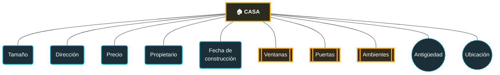

#apuntes #concepto #conceptos 
# NOTACION DE CHEN


## 📌 Definición
> La notación de Chen es la forma de dibujar un **Modelo Entidad-Relación (MER)** propuesta por Peter Chen en 1976. Es la base gráfica que se usa antes de pasar al diseño de tablas en SQL.

## 🖥️ Sintaxis
```
// estructura general de uso
```

## 🧩 Parámetros / Atributos
| Elemento                  | Forma                             | Significado                                                                                                        |
| ------------------------- | --------------------------------- | ------------------------------------------------------------------------------------------------------------------ |
| **Entidad**               | Rectángulo                        | Un objeto o concepto del mundo real (ej. `Casa`, `Cliente`, `Producto`)                                            |
| **Atributo simple**       | Elipse (una línea)                | Una propiedad de la entidad que no se puede dividir (ej. `Precio`)                                                 |
| **Atributo compuesto**    | Elipse con "sub-elipses" colgando | Un atributo que se puede dividir en partes (ej. `Nombre` → `Nombre` + `Apellido`)                                  |
| **Atributo multivaluado** | Elipse doble                      | Un atributo que puede tener **varios valores** para una misma entidad (ej. una casa puede tener varias `Ventanas`) |
| **Atributo derivado**     | Elipse punteada                   | Un atributo que se calcula a partir de otro (ej. `Antigüedad` se calcula desde `Fecha de construcción`)            |
| **Atributo clave**        | Elipse con texto subrayado        | El atributo que identifica de forma única a la entidad (llave primaria)                                            |
| **Relación**              | Rombo                             | Un verbo que conecta dos entidades (ej. `Cliente` — _compra_ — `Producto`)                                         |


## 💡 Ejemplos prácticos




## 🧪 Casos de uso comunes
- 
- 

## ⚠️ Errores comunes
- 

## 🔗 Ver también
- [[]]

## 📚 Referencias
- 
