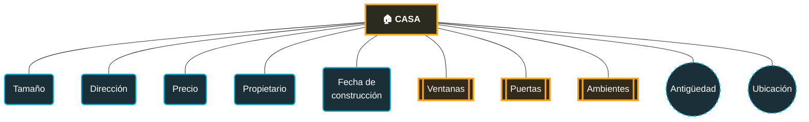

# NOTACION DE CHEN


## 📌 Definición
> La notación de Chen es la forma de dibujar un **Modelo Entidad-Relación (MER)** propuesta por Peter Chen en 1976. Es la base gráfica que se usa antes de pasar al diseño de tablas en SQL.

## 🖥️ Sintaxis
```
// estructura general de uso
```

## 🧩 Parámetros / Atributos
| Elemento                  | Forma                             | Significado                                                                                                        |
| ------------------------- | --------------------------------- | ------------------------------------------------------------------------------------------------------------------ |
| **Entidad**               | Rectángulo                        | Un objeto o concepto del mundo real (ej. `Casa`, `Cliente`, `Producto`)                                            |
| **Atributo simple**       | Elipse (una línea)                | Una propiedad de la entidad que no se puede dividir (ej. `Precio`)                                                 |
| **Atributo compuesto**    | Elipse con "sub-elipses" colgando | Un atributo que se puede dividir en partes (ej. `Nombre` → `Nombre` + `Apellido`)                                  |
| **Atributo multivaluado** | Elipse doble                      | Un atributo que puede tener **varios valores** para una misma entidad (ej. una casa puede tener varias `Ventanas`) |
| **Atributo derivado**     | Elipse punteada                   | Un atributo que se calcula a partir de otro (ej. `Antigüedad` se calcula desde `Fecha de construcción`)            |
| **Atributo clave**        | Elipse con texto subrayado        | El atributo que identifica de forma única a la entidad (llave primaria)                                            |
| **Relación**              | Rombo                             | Un verbo que conecta dos entidades (ej. `Cliente` — _compra_ — `Producto`)                                         |


## 💡 Ejemplos prácticos




> [!tip] Regla rápida Si te preguntas "¿esto puede repetirse varias veces para la misma fila?" → es **multivaluado**. Si te preguntas "¿esto lo puedo calcular con otro dato que ya tengo?" → es **derivado**.

**Leyenda de formas usadas arriba** (adaptadas a lo que Mermaid permite dibujar):

- Rectángulo  → Entidad
- Óvalo  → Atributo simple
- Doble borde → Atributo multivariado (Ventanas, Puertas, Ambientes: una casa puede tener varias)
- Círculo  con borde punteado → Atributo derivado (Antigüedad y Ubicación se calculan/derivan de otros datos)

## Relaciones y cardinalidad (complemento)

- **1:1** → un cliente tiene un solo carnet
- **1:N** → un cliente compra muchos productos
- **N:M** → muchos estudiantes cursan muchas materias

## Notas rápidas para repasar

- El modelo ER es el paso previo al diseño de tablas: cada entidad suele convertirse en una tabla, y cada atributo en una columna.
- Los atributos multivaluados normalmente **no se dejan como columna múltiple**: se convierten en su propia tabla relacionada (por eso Dalto insiste tanto en identificarlos bien desde el diagrama).
- Los atributos derivados casi nunca se guardan como columna física; se calculan con una consulta (`SELECT`) cuando se necesitan.
## 🧪 Casos de uso comunes
- El modelado de chen donde se utiliza relaciones y cardinalidad se podria utilizar para definir valores como: salarios, notas, estadísticas, para organizar información de una institución o de clientes, entre otras mas, donde se utiliza valores de 1:1 (uno a uno), 1:N (de uno a muchos), N:M ( de muchos a muchos)
- También podría utilizarse para mantener tasas de intereses en un banco o en otra entidad donde se podría mantener esos valores o en tal caso actualizar, modificar o dividir valores en la base de datos

## ⚠️ Errores comunes
- 


